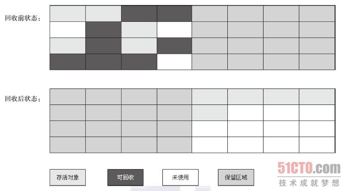

#  

--------
                                   《深入理解 Java 虚拟机--JVM高级特性与最佳实践》
--------

> ```
>
> ```
    关于这本书已经断断续续的看了好几遍了，使自己对jvm有了很深的理解，但是由于长时间的不用，对很多的功能点有所遗忘，特此写下这篇随手记，为以后的回忆与学习提供帮助，第一次写这种笔记，有种无从下手的感觉，后续持续改进中。。。
> ```
>
> ```


### 1、关于java内存区域与内存溢出异常

​       下图为java运行时jvm将它所管理的内存划分的各个不同的数据区域，这些区域都有各自不同的用途，接下来，我会将这些区域的用途进行详细的介绍。


#### 1.1 程序计数器

​          程序计数器是一块较小的内存空间，它可以看做是当前线程所执行的字节码的行号指示器，字节码解释器就是通过它来确定java代码的执行顺序的，每一个线程都拥有独立的程序计数器，多线程是通过程序轮流切换处理器执行时间的方式来实现的，程序计数器可以保证每一个线程在切换后可以恢复到正确的执行位置。

#### 1.2 java虚拟机栈

​         许多coder将内存分为堆和栈，通过上图，我们知道，这种说法比较笼统，但是堆和栈确实占据了内存中大部分的空间，这个“栈”指的就是java虚拟机栈。

​        与程序计数器相同，java虚拟机也是线程所私有的，生命周期与线程相同，每个方法在执行的同时都会创建一个栈帧，用来存储局部变量表、操作数栈、动态链接、方法出口等信息。每一个方法从调用到执行完毕的过程就对应着一个栈帧在虚拟机栈中的入栈到出栈的过程。


 

#### 1.3 本地方法栈

​         本地方法栈与java虚拟机栈作用相似，区别在与java虚拟机栈是为执行java方法而创建的栈，本地方法栈是为执行本地方法而创建的栈。

#### 1.4 java堆

​          java堆是在虚拟机启动的时候创建的，是被所有线程所共享的数据区域，它没有特殊的数据结构，只是内存的一块存储区域，占内存比例非常大，此区域的唯一目的就是存储创建的对象，java堆是垃圾收集器的主要管理区域，因此也被称为“GC堆”。

#### 1.5 方法区

​         与java堆相似，方法区也是被所有线程所共享的数据区域，它用于存储**已被**虚拟机加载的类信息、常量、静态变量、即时编译器编译后的代码等数据。

#### 1.6 其他注意点

​        直接内存：直接内存不是java数据区中的内存，在jdk4中的nio（New Input/Output）中，引入了一种根据堆中DirectByteBuffer对象的引用来对这块直接内存进行操作的机制，直接内存是native函数库直接分配的堆外内存，这样可以避免java堆与Native堆之间数据的来回复制，因此，在机器上给java分配内存时，要注意有直接内存的存在。

### 2 Hot Spot 虚拟机对象的介绍

#### 2.1 对象的创建

​     1）虚拟机在遇到new这个指令时，首先会去方法区中的常量池检查该对象的类是否已经被加载过了，未加载过，则先进行类的加载、解析和初始化，然后为这个对象在堆上分配内存，内存的大小固定（大小通过它的类得知）。

​    2）内存分配完毕后，虚拟机将分配到的内存空间都初始化为零值（这就是为什么对象未初始化字段的话，基本类型为0，而引用类型为null）
```
package ObjectCreate;

public class DataInitTest {

public static void main(String[] args) {
	Data data = new Data();
	System.out.println(data.intA);
	System.out.println(data.doubleB);
	System.out.println(data.charC);
	System.out.println(data.floatD);
	System.out.println(data.booleanE);
	System.out.println(data.longF);
	System.out.println(data.byteG);
	System.out.println(data.data);
}

}

class Data{
	


int intA;
double doubleB;
char charC;
float floatD;
boolean booleanE;
long longF;
byte byteG;
Data data;


}
```
运行结果为：


​     3）接下来，虚拟机要对对象头进行必要的设置，例如：这个对象时哪个类的实例，如何能找到类的元数据信息、对象的哈希码、对象的GC年龄等信息。

#### 2.2 对象的引用

​     在java虚拟机栈调用方法时，方法可能会用到引用变量，目前通过引用变量找到对象主流有两种方式：通过句柄访问对象、通过直接指针访问对象。

   1）通过句柄访问对象的话，引用中存的是句柄的地址，句柄中存放实例数据和类型数据的地址。


​    2）通过直接指针访问的话，引用中存放的就是对象地址，Hot Spot虚拟机使用的就是这种方式。


#### 2.3 JVM参数表

​    在有网络的前提下[点击此处](http://blog.csdn.net/coslay/article/details/49725899)查看JVM 参数表。

### 3 垃圾收集器

#### 3.1 怎么判断一个对象已经“死亡”

​     可达性分析算法：这个算法的基本思路就是通过一系列的称为“GC roots”的对象作为起始点，从这些节点开始向下搜索，搜索走过的路径称为引用链，当一个对象到GC roots没有任何引用链相关联时，这个对象就是“死亡”的，下次进行GC时，若是该对象的finalize()方法没有重写或者已经被调用过，则该对象会被回收清理。

#### 3.2 垃圾收集算法

​      根据对象存活周期的不同将java堆内存划分为新生代和老年代，新生代使用标志-清除算法、复制算法，老年代使用标记-整理算法。

​      标志-清除算法：非常简单理解，就是先标记、然后清除的算法。


​       复制算法：将可用的内存容量分为相同大小的两份，每次只使用其中的一份，当这一块的内存使用完了，就将还存活的对象复制到另一半空着的内存中，然后把使用过的内存清空，这样就可以每次对半个内存的回收，而且没有碎片的产生.



由上图可以看出这种算法对于内存的利用率只有50%，根据IBM研究，新生代上的对象有98%都是“朝生夕死”的，所以不需要按照1:1的比例来划分内存空间，而是将内存分为一块较大的Eden空间和两块较小的Survivor空间，每次只使用Eden和一个Survivor空间，回收后，将剩余的对象复制到另一块空闲的Survivor空间上，Hot Spot虚拟机的Eden和Survivor空间的比例为8:1，有一个潜在的风险，如果剩余的对象的内存大于另一块空闲的Survivor空间，这种机制就会出现问题，Hot Spot的解决方案是：使用老年代作为担保，将多余的对象放入老年区中。

​      标记-整理算法：首先标记出所有需要回收的对象，在标记完成后统一回收被标记的对象，完成后，将存活的对象都向一端移动，然后清理掉端边界以外的内存。


#### 3.3 算法实现

​    在可达性分析算法分析算法中不可以出现在分析过程中对象的引用关系还在不断的变化的情况，所以在分析过程中必须使得整个执行系统冻结在一个点上，这点导致GC进行时必须停顿所有java执行线程，在这个冻结点上GC需要一个不漏的检查完所有执行上下文和全局的引用，如果在任意时间点上，都需要可以完成这样的操作，GC消耗的资源显然非常大，Hot Spot虚拟机是这样解决的，在每一个线程里面设置一些安全点（softpoint），在这个安全点上有OopMap的数据结构，里面包含着对象引用的信息，GC扫描其即可获得引用关系，从而进行GC，即：只有在安全点才可以获得引用关系，进行GC。

FAQ：

1）安全点的位置？

​             安全点的选择位置一般为：程序方法调用、循环跳转、异常跳转这些相对执行时间较长的位置为安全点。

2）如何在发生GC时，保证所有线程都到达安全点？

​             设置轮询标志，该标志表示是否需要GC，轮询标志的位置与安全点位置相同，当线程达到安全点后，查看轮询标志，若为真，则停止继续执行，等待其他线程也达到安全点。

 3）当线程在Sleep或Blocked状态，无法到达安全点，怎么办？

​              设置安全区域（Soft Region）：在一段代码片段中，引用关系不会发生变化的区域。当线程进入安全区域后，首先标识自己进入安全区域，那样在进行GC时，此线程未达到安全点也无关系，在离开Soft Region时，先判断是否GC完成，未完成，等待完成后，在继续执行。

#### 3.4 垃圾收集器的特性

​                <u>在虚拟机中，各个垃圾收集器都已经实现，根据业务的特性与各个收集器特点，使用参数开关来选择虚拟机执行那种垃圾收集器。</u>

**Serial 收集器**：这个收集器是一个“单线程”的收集器，这个“单线程”不仅仅说明它只会使用一个CPU或者一条收集线程去完成垃圾收集工作，更重要的是在它进行垃圾收集的时候，必须暂停其他所有的工作线程，直到它收集结束。


缺点：你想象一下，如果你的系统没执行一个小时，就要停顿5分钟，来进行垃圾收集，（有点夸张），你能接受么？

优点：简单而且高效，对于限定单个CPU的环境来说，Serial收集器由于没有线程交互的开销，专心做垃圾收集自然可以获得最高的单线程收集效率。在用户的桌面应用场景中，分配给虚拟机管理的内存一般不会很大，停顿时间大约为几十毫秒，只有不是频繁发生，这点停顿完全可以接受，所以Serial收集器仍然是运行在Client模式下的默认新生代收集器。

**ParNew 收集器**：这个收集器其实就是Serial收集器的多线程版本，代码都有很多是共用的。


缺点：在单CPU的情况下，由于多线程的开销，还没有Serial收集器好用。

优点：随着CPU的个数越多越好用，可以与CMS收集器搭配使用，是运行在Server模式下虚拟机的首选新生代收集器。

**Parallel Scavenge 收集器**：这个收集器与ParNew收集器很像，区别在于它所关注的是吞吐量的提升。吞吐量=运行用户代码时间/（运行用户代码时间+垃圾收集时间），使用这个垃圾收集器时，它提供两个参数。

-XX:MaxGCPauseMillis参数：控制最大垃圾收集停顿时间。它允许一个大于0的毫秒数，收集器将尽可能的保证内存回收花费的时间不超过这个数值，但不是说越小越好，小的话，它会通过减少回收内存的大小来达到，例如：设置500，它回收500M的内存空间，设置100，可能就回收了100M的内存空间，这样的话，GC的频率就会增加。

-XX：GCTimeRatio参数：直接设置吞吐量大小。它允许输入一个大于0小于100的整数，也就是垃圾收集时间占总时间的比率，例如：输入19，则允许的最大GC时间就占总时间的5%（1/(1+19)），默认值为99，即1%。

缺点：与ParNew相同。

优点：关注吞吐量，可以进行自动调节。

**Serial Old 收集器**：这个收集器是Serial 收集器的老年代版本，同样是一个单线程的收集器，使用标识-整理算法，给Client模式下的虚拟机使用，两大用途：

1）与parallel Scavenge 收集器搭配使用（性能比较低）。

2）在后续讲的CMS收集器收集失败后，作为预备使用。


**Parallel Old 收集器**：这个收集器是Parallel Scavenge 的老年代版本，使用多线程和“标记-整理”算法，在此收集器未出现时，新生代收集器用Parallel Scavenge ，老年代只能使用Serial Old收集器，但是Serial Old是单线程的，在Server 虚拟机中，无法发挥出服务器的性能，使得吞吐量不能最优，这个收集器是为了解决这个问题而生的，它通常与Parallel Old收集器搭配使用，来达到吞吐量最优。


**CMS 收集器**：老年代垃圾收集器，这款收集器是一种以获取最短回收停顿时间为目标的收集器，使用“标记-清除”算法实现，具体分为4个步骤初始标记（单线程，需要停止用户线程，时间较短）、并发标记（单线程、不需要停止用户线程，时间相对较长）、重新标记（多线程，需要停止用户线程，时间较短）、并发清除（单线程、不需要停止用户线程，时间较长）


缺点：1）对cpu资源比较敏感，默认开启线程数=（CPU数量+3）/4，这样的话，在并发过程中会大量占去用户线程的资源。

​           2）无法清理浮动垃圾，在进行并发清除时，用户线程产生的垃圾，无法清除，因为在并发，清理的同时，用户进程也在产生垃圾，所以不能内存占用达到100%时在进行GC，jdk1.6后，默认为老年内存达到92%时（可以使用-XX：CMSInitiatingOccupancyFraction参数进行设置），进行GC，但是一旦预留内存不够，则会GC失败，这时会使用Serial Old收集器进行一次GC，这样的话，GC时间更加长。

​          3）使用“标记-清除”算法，GC后会产生大量的内存碎片，为了解决这个问题，CMS收集器提供-XX:+UseCMSCompactAtFullCollection参数（默认开启）设置CMS下一次要提前Full GC时，开启碎片整理过程。

优点：适合互联网站或B/S系统的服务端，重视服务器响应速度，希望系统停顿时间短，CPU数量多的Server端。

**G1收集器**：此收集器与CMS收集器很像，但是使用“标记-整理”算法。G1收集器在内存上将整个java堆分为多个相同大小的独立区域，在收集的过程中会为其创建优先级，根据优先级进行垃圾回收，G1进行垃圾回收可以分为以下4个步骤：初始标记、并发标记、最终标记、筛选回收。


*在作者写此书时，此收集器刚刚完成不久，写的比较笼统，我理解起来有些模糊。后续在改进*

#### 3.5 垃圾收集器参数总结

| 参数                             | 描述                                       |
| :----------------------------- | :--------------------------------------- |
| UseSerialGC                    | 虚拟机运行在Client 模式下的默认值，打开此开关后，使用Serial +Serial Old 的收集器组合进行内存回收 |
| UseParNewGC                    | 打开此开关后，使用ParNew + Serial Old 的收集器组合进行内存回收 |
| UseConcMarkSweepGC             | 打开此开关后，使用ParNew + CMS + Serial Old 的收集器组合进行内存回收。Serial Old 收集器将作为CMS 收集器出现Concurrent Mode Failure失败后的后备收集器使用 |
| UseParallelGC                  | 虚拟机运行在Server 模式下的默认值，打开此开关后，使用ParallelScavenge + Serial Old（PS MarkSweep）的收集器组合进行内存回收 |
| UseParallelOldGC               | 打开此开关后，使用Parallel Scavenge + Parallel Old 的收集器组合进行内存回收 |
| SurvivorRatio                  | 新生代中Eden 区域与Survivor 区域的容量比值， 默认为8， 代表Eden ：Survivor=8∶1 |
| PretenureSizeThreshold         | 直接晋升到老年代的对象大小，设置这个参数后，大于这个参数的对象将直接在老年代分配 |
| MaxTenuringThreshold           | 晋升到老年代的对象年龄。每个对象在坚持过一次Minor GC 之后，年龄就加1，当超过这个参数值时就进入老年代 |
| UseAdaptiveSizePolicy          | 动态调整Java 堆中各个区域的大小以及进入老年代的年龄             |
| HandlePromotionFailure         | 是否允许分配担保失败，即老年代的剩余空间不足以应付新生代的整个Eden 和Survivor 区的所有对象都存活的极端情况 |
| ParallelGCThreads              | 设置并行GC 时进行内存回收的线程数                       |
| GCTimeRatio                    | GC 时间占总时间的比率，默认值为99，即允许1% 的GC 时间。仅在使用Parallel Scavenge 收集器时生效 |
| MaxGCPauseMillis               | 设置GC 的最大停顿时间。仅在使用Parallel Scavenge 收集器时生效 |
| CMSInitiatingOccupancyFraction | 设置CMS 收集器在老年代空间被使用多少后触发垃圾收集。默认值为68%，仅在使用CMS 收集器时生效 |
| UseCMSCompactAtFullCollection  | 设置CMS 收集器在完成垃圾收集后是否要进行一次内存碎片整理。仅在使用CMS 收集器时生效 |
| CMSFullGCsBeforeCompaction     | 设置CMS 收集器在进行若干次垃圾收集后再启动一次内存碎片整理。仅在使用CMS 收集器时生效 |

### 4 内存分配

​      内存分配并不是绝对的，这里只是介绍一些简单的分配规则。

- 新创建对象一般都创建在java堆得Eden区。
- 设置-XX:PretenureSizeThreshold参数的值来确定创建超过这个值得对象直接进入老年代。
- 设置MaxTenuringThreshold参数的值来确定对象经过多少次GC后进入老年代（对象的GC年龄，我们在前面创建对象的时候提到过，存放在对象头中）

### 5 虚拟机的类加载机制

定义：虚拟机把描述类的数据从"Class文件"加载到内存，并对数据进行校验、转换解析和初始化，最终形成可以被虚拟机直接使用的java类型。这里的“Class文件“指的是一串二进制字节流，可以来源于磁盘的Class文件，也可以来源于网上，甚至是程序自己生成的都是可以的。

#### 5.1 类加载的时机

类的生命周期：加载、验证、准备、解析、初始化、使用、卸载。

我们知道类是程序在运行的时候进行动态加载的，但是，什么时候进行类的加载呢，下面这几种情况是类的加载时机。

- 遇到new（创建对象）、getstatic（取读静态字段）、putstatic（设置静态字段）、invokestatic（调用静态方法）时，如果对应的类没有加载过，则需要进行加载。
- 使用java.lang.reflect包的方法对类进行反射调用的时候，如果对应的类没有加载过，则需要进行加载。
- 当初始化一个类，发现其父类还没有初始化，则需要先触发父类的初始化。
- 当虚拟机启动时，用户需要指定一个要执行的主类（包含main方法），虚拟机要先初始化这个类。
- jdk1.7中，如果一个java.lang.invoke.MethodHandle实例最后的解析结果REF_getStatic、REF_putStatic、REF_invokeStatic的方法句柄，并且这个方法句柄所对应的类没有初始化，则需要先进行初始化。

#### 5.2 类加载步骤详解

**加载**：是“类加载”过程中的一个阶段，在这个阶段，虚拟机需要完成3件事情：

1. 用过一个类的全限定名来获取定义此类的二进制字节流。
2. 将这个字节流所代表的静态存储结构转化为方法区的运行时数据结构。
3. 在内存中生成一个代表这个类的java.lang.Class对象，作为方法区这个类的各种数据的访问入口。

**验证**：这一阶段的目的是为了保证Class文件的字节流信息符合当前虚拟机的要求，并且不会危害虚拟机自身的安全。（前面已经讲过了，虽然java语言是相对安全的语言，但是Class文件的字节流不一定是来自java语言，其他语言也可以生成）。

该阶段主要进行以下几个方面的验证：

1. 文件格式验证：验证字节流是否满足Class文件的规范，是否能被当前版本的虚拟机所理解。
2. 元数据验证：对字节码描述的信息进行语义分析，以保证其描述的信息符合java语言规范的要求。
3. 字节码验证：主要通过数据流和控制流分析，确定程序语义是否合法，合乎逻辑。
4. 符号引用验证：对类自身以外的信息进行匹配性校验。

**准备**：该阶段是为类变量分配内存并设置类变量初始值的阶段，这些变量所使用的内存都是在方法区中。

知识点：初始值指的是零值，类变量指的是被static修饰的变量而不是实例变量。

**解析**：该阶段是虚拟机将常量池内的符号引用替换为直接引用的过程。

符号引用：指的是在Class文件中的字面量形式，引用的对象可以未加载到内存中。

直接引用：指的是一个指向地址的指针或句柄或偏移量，可以根据它找到对象的引用，引用的对象必须已经加载到内存中。

**初始化**：真正执行类中定义的java代码，前面讲过，加载过程会为字段赋予“零值”，而字段真正的值得赋值过程是在初始化过程完成的。

#### 5.3 类加载器

定义：虚拟机设计团队把类加载阶段中的“**通过一个类的全限定名来获取描述此类的二进制字节流**”这个动作放到java虚拟机外部去实现，以便让应用程序自己决定如何去获取所需要的类。实现这个动作的代码模块称为“类加载器”。

**类加载器分为：启动类加载器、扩展类加载器、应用程序类加载器**

启动类加载器：这个类加载器负责将存放在<JAAVA_HOME>/lib目录中的，或者被-Xbootclasspath参数所指定的路径中的，并且是虚拟机识别的类库（按照文件名的方式）加载到虚拟机内存中。

扩展类加载器：这个加载器由sun.misc.Launcher$ExtClassLoader实现，它负责加载<JAVA_HOME>\lib\ext目录中的，或者被java.ext.dirs系统变量所指定的路径中的所有类库，开发者可以直接使用扩展类加载器。

应用程序类加载器：也叫系统类加载器，负责加载用户类路径上所指定的类库。

双亲委派模型：如果一个类加载器收到了类加载的请求，他首先不会自己去尝试加载这个类，而是把这个请求委派给父类加载器去完成，每一个层次的类加载器都是如此，因此所有的加载请求最终都应该传送到顶层的启动类加载器中，只有当父加载器反馈自己无法完成这个请求时，子加载器才会尝试自己去加载。


双亲委派模型代码实现：

```
protected synchronized Class<?> loadClass(String name, Boolean resolve) throws ClassNotFoundException{        
		//首先检查请求的类是否已经被加载过       
		Class c = findLoadedClass(name);        
		if(c == null){
        try{            
        	if(parent != null){//委派父类加载器加载        
        c = parent.loadClass(name, false);    
}    
else{//委派启动类加载器加载        
     c = findBootstrapClassOrNull(name);     
     }    
     	}catch(ClassNotFoundException e){        
     	//父类加载器无法完成类加载请求    
     	}    if(c == null){//本身类加载器进行类加载        
     					c = findClass(name);    
     					}    
     	}    if(resolve){        
     					resolveClass(c);    
     					}    
     		return c;    
 } 
```

知识点：双亲委派模型的类加载器的优先级不是像继承那种强制性的，而更像是一种约定。

### 6 虚拟机的字节码执行引擎

执行引擎是java虚拟机最核心的组成部分之一，输入的是二进制字节码流，处理过程是字节码解析的等效过程，输出的是执行结果。

#### 6.1 运行时虚拟机栈帧结构

栈帧是虚拟机运行时数据区中的虚拟机栈中的栈元素，前面提到过每一个方法的调用到执行完毕过程对应着一个栈帧在虚拟机栈里面从入栈到出栈的过程（一个栈帧对应一个方法），每一个栈帧包括：局部变量表、操作数栈、动态链接和方法返回地址等。


**局部变量表**：局部变量表是一组变量值存储空间，用于存放方法参数和方法内部定义的局部变量。

数据结构：在java程序编译为Class文件时，就已经确定了每个方法所需要分配的局部变量的最大容量，虚拟机将此容量以变量槽（Slot）为最小存储单元进行变量的存储，索引为0的Slot默认是当前方法所属对象实例的引用，接下来依次是方法参数、方法中局部变量的存储。


**操作数栈**：操作数栈是一个后入先出的栈，同局部变量表一样，操作数栈的深度也是在编译的时候就已经确定了。

**动态链接**：每一个栈帧都包含一个指向运行时常量池中该栈帧所属方法的引用，持有这个引用是为了支持方法调用过程中的动态链接。

**方法返回地址**：这个很好理解，存的就是调用方法调用当前方法的那个节点的地址。


